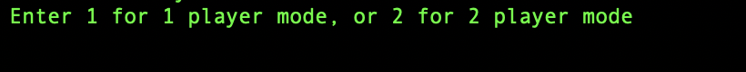
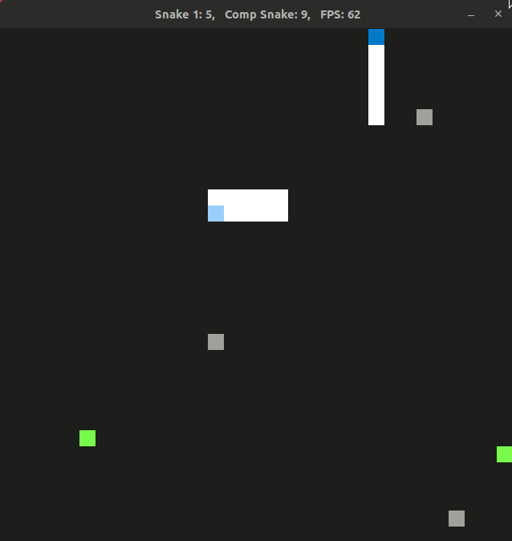
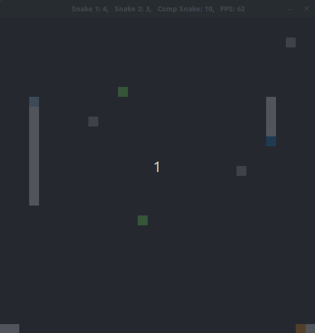
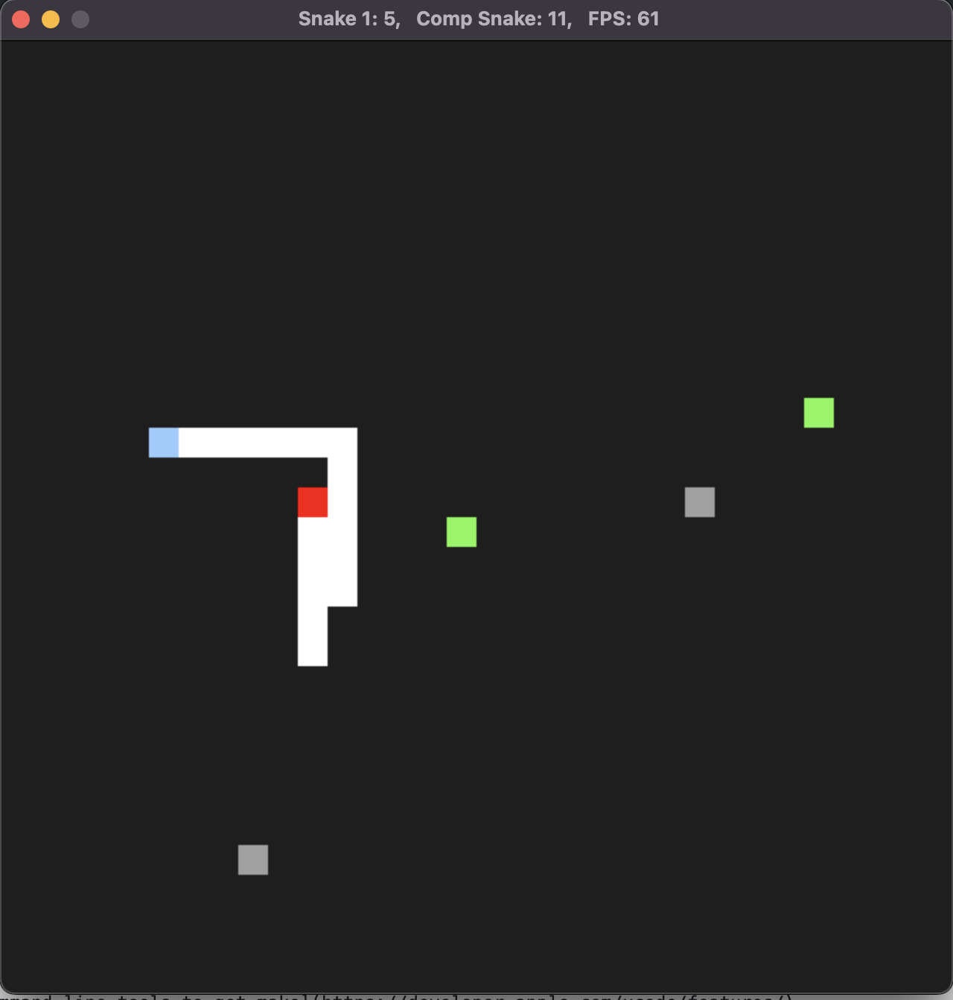
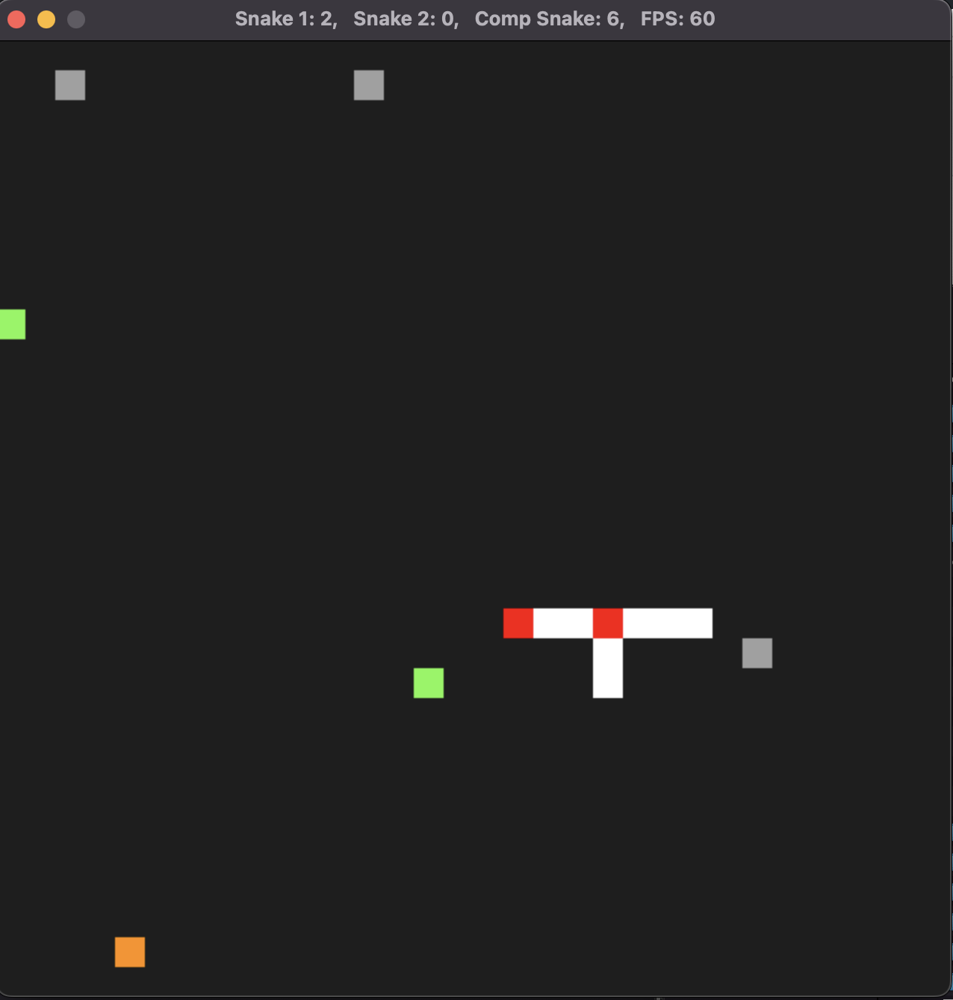
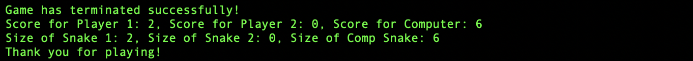

# CPPND: Capstone Snake Game

This is my submission for the Capstone project for the Udacity C++ Nanodegree Program. I have taken the Snake Game starter code and I have extended it by adding features such as a 2 player mode, obstacles, and a computer controlled snake to compete with. With the added features I have encorporated C++ programmin concepts such as OOP, memory management, and multi-threaded programming. 

## Dependencies for Running Locally
* cmake >= 3.7
  * All OSes: [click here for installation instructions](https://cmake.org/install/)
* make >= 4.1 (Linux, Mac), 3.81 (Windows)
  * Linux: make is installed by default on most Linux distros
  * Mac: [install Xcode command line tools to get make](https://developer.apple.com/xcode/features/)
  * Windows: [Click here for installation instructions](http://gnuwin32.sourceforge.net/packages/make.htm)
* SDL2 >= 2.0
  * All installation instructions can be found [here](https://wiki.libsdl.org/Installation)
  >Note that for Linux, an `apt` or `apt-get` installation is preferred to building from source. 
* gcc/g++ >= 5.4
  * Linux: gcc / g++ is installed by default on most Linux distros
  * Mac: same deal as make - [install Xcode command line tools](https://developer.apple.com/xcode/features/)
  * Windows: recommend using [MinGW](http://www.mingw.org/)

## Basic Build Instructions

1. Clone this repo.
2. Make a build directory in the top level directory: `mkdir build && cd build`
3. Compile: `cmake .. && make`
4. Run it: `./SnakeGame`.

## File Structure.
    ├── cmake
    │   └── FindSDL2_image.cmake
    ├── CMakeLists.txt
    ├── CODEOWNERS
    ├── LICENSE.md
    ├── README.md
    ├── Snake_Game_1_player_mode.gif
    ├── Snake_game_2_player_mode.gif
    ├── snake_game.gif
    └── src
        ├── ai_snake.cpp
        ├── ai_snake.h
        ├── controller.cpp
        ├── controller.h
        ├── game.cpp
        ├── game.h
        ├── main.cpp
        ├── obstacle.cpp
        ├── obstacle.h
        ├── renderer.cpp
        ├── renderer.h
        ├── snake.cpp
        └── snake.h

## Class Structure

There are 6 distinct class objects.
- Game class object, which runs the main thread of execution, and main game loop, and spawns the other threads.
- Renderer class object, which renders the game graphics to a window.
- Snake class object, the object that the application user directly controls, each Snake class instance is run in it's own thread.
- AI_Snake class object, this class is a daughter of the Snake class, the AI_Snake class instance is a Snake object that is directly controlled by the computer
  and is run in its own thread
- Controller class object, each Controller instance is paired with a Snake class instance, this class facilitates keyboard input from the user to control the Snake.    
- Obstacle class object, a very simple class, who’s instances act as obstacles on the game map, they are initialized in the main Game instance thread.

## Expected Output.

When executed the program will start by promping the user on terminal to enter a 1 or 2 to chosse between a 1 or 2 player mode.

Expected output and gameplay for 1 player mode.

Expected output and gameplay for 2 player mode.

The object of the game is to avoid obstacles, and other snakes, and collect food, colliding with another snake or an obstacle is instant death, with the head of the snake turning to a red colour. Collecting a food item will make a snake grow longer and increment its speed.The controls for player 1 is the keyboard arrow keys, while the controls for player two follows the WASD control scheme. The running score for each player and the computer is displayed on top of the window. The game can be exited by pressing the close button on the top right corner of the window. 

Example of a snakes colliding with an obstacle.

Example of two snakes colliding.

When the game is exited a mesage with the final score and size of each snake is printed to the terminal.

## CC Attribution-ShareAlike 4.0 International

Shield: [![CC BY-SA 4.0][cc-by-sa-shield]][cc-by-sa]

This work is licensed under a
[Creative Commons Attribution-ShareAlike 4.0 International License][cc-by-sa].

[![CC BY-SA 4.0][cc-by-sa-image]][cc-by-sa]

[cc-by-sa]: http://creativecommons.org/licenses/by-sa/4.0/
[cc-by-sa-image]: https://licensebuttons.net/l/by-sa/4.0/88x31.png
[cc-by-sa-shield]: https://img.shields.io/badge/License-CC%20BY--SA%204.0-lightgrey.svg
